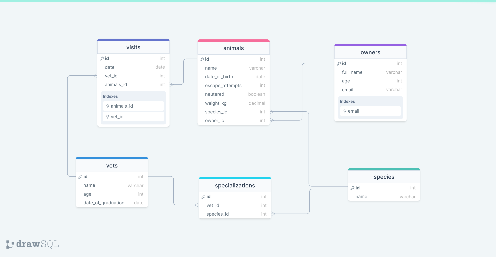

# 📗 Table of Contents

- [📖 About the Project](#about-project)
- [💻 Getting Started](#getting-started)
- [👥 Authors](#authors)
- [🔭 Future Features](#future-features)
- [🤝 Contributing](#contributing)
- [⭐️ Show your support](#support)
- [📝 License](#license)

# 📖 Vet clinic database 

**Vet clinic database** is a project where we will use a relational database to create the initial data structure for a vet clinic. We will create a table to store animals' information, insert some data into it, and query it.

**Database schema diagram**

 

## 💻 Getting Started 

This repository includes files with plain SQL that can be used to recreate a database:

- Use [schema.sql](./schema.sql) to create all tables.
- Use [data.sql](./data.sql) to populate tables with sample data.
- Check [queries.sql](./queries.sql) for examples of queries that can be run on a newly created database. **Important note: this file might include queries that make changes in the database (e.g., remove records). Use them responsibly!**

## 👥 Authors 

👤 **Jorge**

- GitHub: [@githubhandle](https://github.com/jorgegoco)
- Twitter: [@twitterhandle](https://twitter.com/JorgeGo78017548)
- LinkedIn: [LinkedIn](https://www.linkedin.com/in/jorgegoco/)

(<a href="#readme-top">back to top</a>)

## 🔭 Future Features 

- [ ] **Add new tables**
- [ ] **Add more data**
- [ ] **Exhaust all query posibilities**

## 🤝 Contributing 

Contributions, issues, and feature requests are welcome!

Feel free to check the [issues page](https://github.com/jogegoco/vet-clinic-postgresSQL/issues).

## ⭐️ Show your support 

If you like this project...- give it a ⭐️!

## 📝 License 

This project is [MIT](./MIT.md) licensed.

_NOTE: we recommend using the [MIT license](https://choosealicense.com/licenses/mit/) - you can set it up quickly by [using templates available on GitHub](https://docs.github.com/en/communities/setting-up-your-project-for-healthy-contributions/adding-a-license-to-a-repository). You can also use [any other license](https://choosealicense.com/licenses/) if you wish._

(<a href="#readme-top">back to top</a>)

